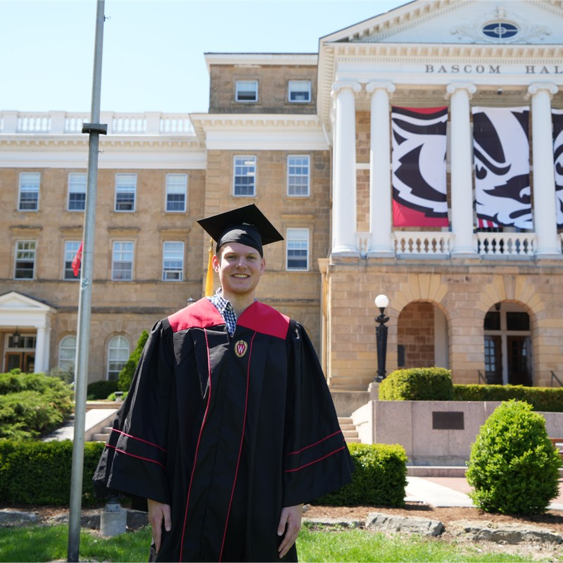

{width=25%}

## About Me

Hello everyone, my name is Nate Truettner and I am a second-year master's student at the University of Michigan in the Computational Epidemiology program. 

---

## Education Completed

**University of Wisconsin-Madison**  
*B.S., Biology* (2019 – 2023)  
*B.S., Chemistry* (2019 – 2023)  
*Certificate, Environmental Studies* (2019 – 2023)  

---

## Experience

**Cancer Epidemiology, Prevention, and Control Intern - Henry Ford Health**  
*May - August 2025*  
-- Utilized R and Python to conduct data analysis for prostate cancer prevention research 
-- Analyzed relationship between cellular senescence and prostate cancer risk 
-- Delivered group presentation on AI and its proper uses in research

---

## Skills

- **Programming:** R, Python, SQL  
- **Data Analysis:** Regression, Visualization  

---

## Projects

### Ensemble Model for Valley Fever in Arizona
- Created an ensemble model in R for forecasting valley fever incidence in 3 counties in Arizona
- Created visuals to show projected disease burden and fit to observed data
- Utilized DLNMs and quasipoisson methods

---

## Hobbies/Favorites

- In my free time, I enjoy going to the movies, baseball, long hikes, and reading
- Favorite book: *The Dark Forest* by Cixin Liu
- Favorite video game: Uncharted 4

---

## Contact

- Email: ntruettn@umich.edu
- LinkedIn: https://www.linkedin.com/in/nathan-truettner-244232229/
- GitHub: https://github.com/ntruettner1

---